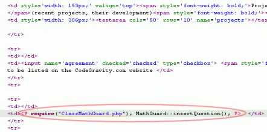

# ZexBre\MathGuard

## MathGuard form antispam protection version 3.1

<https://www.codegravity.com/projects/mathguard>

Creating this website I attracted lots of spambots to flood my forum, my
programming resources, freelance database and other forms, but you probably
know this situation very well. So I decided to create a simple PHP Class
which could help me and probably other people to deal with the spam.

<p></p>

You have probably seen this solution before on some other websites, it's nothing
new, but I did it by myself and the way I wanted and I am using it everywhere
it's needed.

### The principle of this antispam class

The principle is very simple - The class inserts a small piece of HTML code into
your form - an expression consisting of two random numbers, one text input field
for user's answer, and one hidden field with the hashcode.

When user submits the form with the answer, the answer is being hashed and
compared to the security code that has been submitted as well.

### How to set up this PHP antispam class and use it on your website?

#### 1. Download the code of MathGuard

Go to the [download section](https://www.codegravity.com/download/) on this
website and find there the **mathguard.zip**.

#### 2. Unzip the archive and copy the

#### 3. Open the code with the form you want to protect

#### 4. Add the following code snippet (the one in the ellipse)

<p></p>

#### 5. Protect the form handler

<p></p>

```php
/* first we need to require our MathGuard class */
namespace ZexBre\MathGuard\MathGuard;

/* this condition checks the user input. Don't change the condition, just the body within the curly braces */
if (MathGuard :: checkResult($_REQUEST['mathguard_answer'], $_REQUEST['mathguard_code'])) {
    echo ("Great !"); //insert your code that will be executed when user enters the correct answer
} else {
    echo ("Bad answer, go back to school !");	//insert your code which tells the user he is spamming your website
}
```

#### 6. Open the form in your browser and you should see the mathguard's security question there

#### 7. Example

There is also an example in the mathguard.zip. It features a simple form and one
simple form handler which displays the data.

#### 8. Enjoy !

If you'd have any questions, feel free to write to the comments or directly to
my email.

[CodeGravity.com](https://www.CodeGravity.com)
